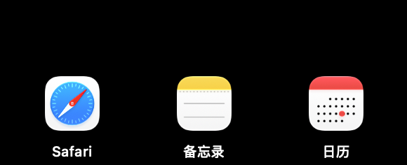

# NotchLauncher

[](https://github.com/BiBoyang/NotchLauncher/releases/latest)
[](LICENSE)


把 MacBook 刘海变成一个应用启动面板:鼠标悬停刘海展开面板,点击图标启动/激活应用。纯 AppKit + SPM,无第三方依赖。



## 功能

- **悬停展开**:鼠标移到刘海区域,面板自动下拉展开;移开自动收起
- **点击启动**:点击图标启动应用;已运行则激活置前;运行中的应用带小圆点标识
- **拖入添加**:从 Finder/Dock 拖 `.app` 到刘海,面板展开后松手即添加(自动读取名称/bundleID,重复条目自动跳过)
- **拖出删除**:把面板里的图标拖出面板区域(越界超过 24pt)松手即删除;小幅误拖会自动回弹不删
- **右键菜单**:面板空白处右键 → 添加应用…(NSOpenPanel 多选)/ 编辑配置文件 / 重新加载 / 退出

## 要求

- macOS 13+,带刘海的 MacBook(依赖 `safeAreaInsets.top > 0` 探测刘海)

## 下载

不想自己编译:到 [Releases](https://github.com/BiBoyang/NotchLauncher/releases/latest) 下载 zip,解压得到 `NotchLauncher.app`,拖入 `/Applications` 或 `~/Applications` 直接打开。

应用已用 Developer ID 签名并通过 Apple 公证,Gatekeeper 直接放行。建议加入登录项(系统设置 → 通用 → 登录项)。

## 配置

配置文件:`~/Library/Application Support/NotchLauncher/apps.json`(首次运行自动创建)。

UI 操作(拖入/拖出/右键添加)会自动写回该文件;也可以右键 →「编辑配置文件」手工编辑,格式:

```json
{
  "apps": [
    { "name": "Safari", "bundleID": "com.apple.Safari" }
  ]
}
```

条目身份:bundleID 优先,无 bundleID 用 path。改完右键 →「重新加载」生效。

## 构建与安装

```bash
swift build                # 调试构建
./scripts/build-app.sh     # release 构建并打包到 build/NotchLauncher.app
open build/NotchLauncher.app
```

## 冒烟测试

应用运行中执行:

```bash
swift scripts/smoke-warp.swift
```

脚本把鼠标 warp 到刘海再移回,观察 stderr 日志出现 `open` / `closed` 即正常。

## English

A macOS launcher that lives in the notch — hover the notch to reveal a panel, click an icon to launch or activate the app.

- Add apps: drag a `.app` onto the notch, the panel expands, drop to add (name/bundleID detected automatically, duplicates skipped)
- Remove apps: drag an icon out of the panel (more than 24pt past the edge) and release; small drags bounce back harmlessly
- Right-click the panel for a menu: add apps via file picker, edit config, reload, quit
- Config lives at `~/Library/Application Support/NotchLauncher/apps.json` and is written back by UI operations
- Requires macOS 13+ and a MacBook with a notch
- Download the signed & notarized build from [Releases](https://github.com/BiBoyang/NotchLauncher/releases/latest), or build it yourself with `swift build` / `./scripts/build-app.sh`

## License

[MIT](LICENSE)
